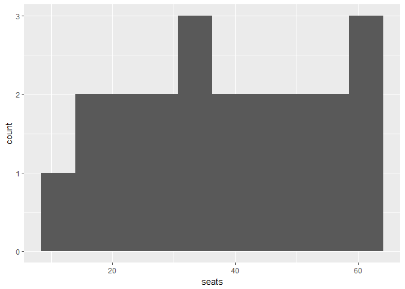
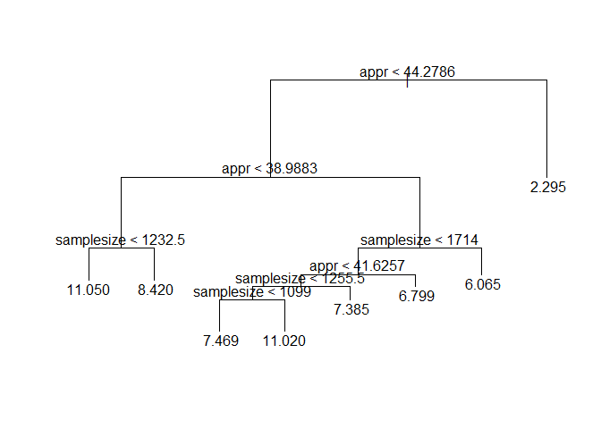
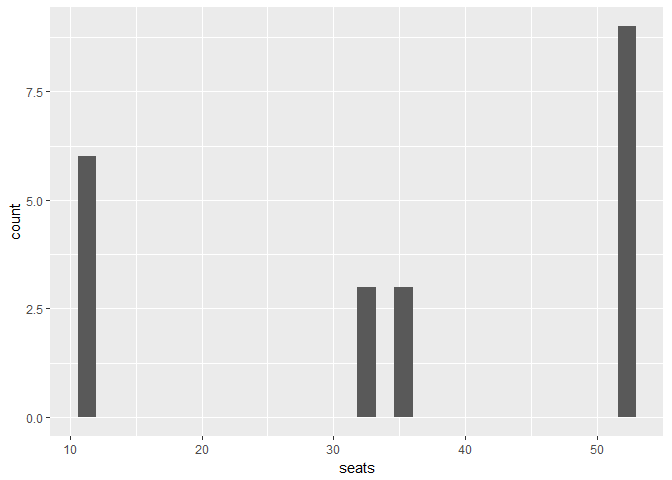

# Final Project
Mitch Borgert  
April 8, 2018  


```r
library(dplyr)
library(lubridate)
library(ggplot2)
library(tree)
midterm_polls = read.csv("C:/Users/mitch/Documents/school/499/assignments-mborgert/data/mid_polls.csv")

approve_polls = read.csv("C:/Users/mitch/Documents/school/499/assignments-mborgert/data/approv_polls.csv")
```


```r
approve_polls$enddate = mdy(approve_polls$enddate)
midterm_polls$enddate = mdy(midterm_polls$enddate)

approve_mean = approve_polls %>% group_by(enddate) %>% summarise(appr = mean(approve))

mid_appr = left_join(midterm_polls,approve_mean, by = "enddate")

mid_appr = mid_appr %>% mutate(demwin = as.numeric(dem - rep))

mod1 = lm(demwin ~ appr + samplesize + enddate,data = mid_appr)

x = ymd("2018-04-19")
enddate = rep(x,100)
appr = 1:100
samplesize = rep(1000,100)

df = data.frame(appr,samplesize,enddate)

predictions = data.frame(predict(mod1,df))
predictions = predictions %>% mutate(probs = predict.mod1..df./100, seats = 468*probs) %>% mutate(super = as.numeric((seats > 70)), regmaj = as.numeric((seats > 0)) )

ggplot(predictions, aes(x = seats)) + geom_histogram(bins = 10)
```

<!-- -->

```r
mean(predictions$super)
```

```
## [1] 0.29
```

```r
mean(predictions$regmaj)
```

```
## [1] 0.55
```

###I combined the midterm polls and the approval polls and then created a new variable called demwin. This variable was the difference between the dem and rep variable and it is the percentage of support one part has over the other. I created a linear model with this variable as the response. The explanatory variables were approval, sample size of the poll, and the end date of the poll. I then created a dataframe with approval from 1% to 100%, sample size constant at 1000, and the end date constant at the last data a poll was recorded. I used this dataframe to create a distribution of predictions for democratic support over republicans based on Trump's approval rating. I then used the predictions to find how many more seats one party would win over the other. One party must have 70 more seats than the other to have a super majority and 1 more seat to have a regular majority. The probability for a super majority is .29 and the probability for a regular majority is .55.


```r
OJ = mid_appr %>% select(demwin,appr,samplesize,enddate)
set.seed(1)
mod2 <- tree(demwin ~ .-demwin, data = OJ)

cv.oj <- cv.tree(mod2)
plot(cv.oj)
```

<!-- -->

```r
mod2prune <- prune.tree(mod2, best = 8)
plot(mod2prune)
text(mod2prune, pretty = 0)
```

<!-- -->

####Heres the nice looking tree and the plot I used to find the best size. 


```r
predictions2 = data.frame(predict(mod2prune,df))
```

```
## Warning in pred1.tree(object, tree.matrix(newdata)): NAs introduced by
## coercion
```

```r
predictions2 = predictions2 %>% mutate(probs = predict.mod2prune..df./100, seats = 468*probs) %>% mutate(super = as.numeric((seats > 70)), regmaj = as.numeric((seats > 0)) )
ggplot(predictions2, aes(x = seats)) + geom_histogram()
```

```
## `stat_bin()` using `bins = 30`. Pick better value with `binwidth`.
```

<!-- -->

```r
mean(predictions2$super)
```

```
## [1] 0
```

```r
mean(predictions2$regmaj)
```

```
## [1] 1
```

###I have the same variables as before but this time I made a tree. I then used cross validation on this tree to get the best size and I then pruned the tree. With a tree there are only 4 options for the amount of seats that one party will win over the other. Democrats are 100% expected to have a majority, but they are not expected to have a super majority according to this tree. I feel that a tree would be much better with more related variables in the dataframe. 

