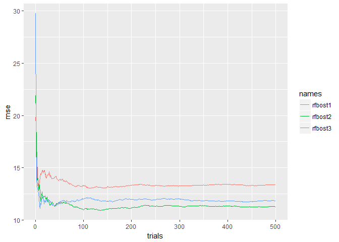
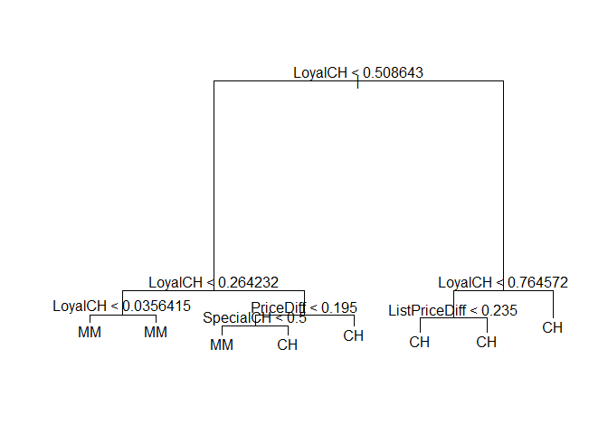
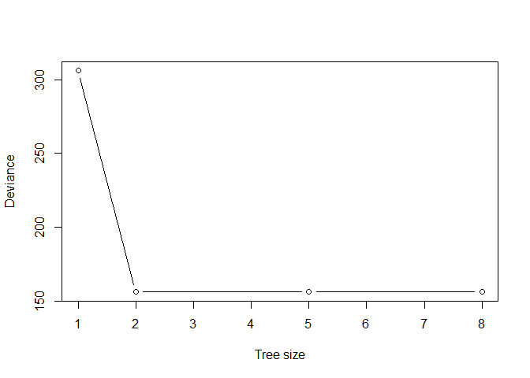
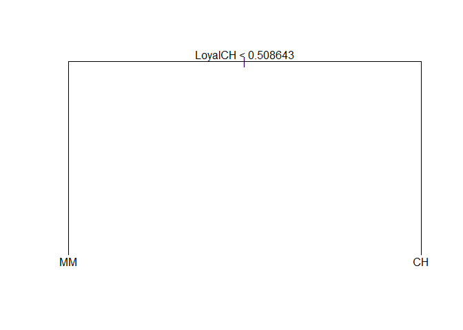

# islr_chapter_8
Mitch Borgert  
April 8, 2018  

#8.5: Suppose we produce ten bootstrapped samples from a data set containing red and green classes. We then apply a classification tree to each bootstrapped sample and, for a specific value of X, produce 10 estimates of P(Class is Red|X): 0.1, 0.15, 0.2, 0.2, 0.55, 0.6, 0.6, 0.65, 0.7, and 0.75.

#There are two common ways to combine these results together into a single class prediction. One is the majority vote approach discussed in this chapter. The second approach is to classify based on the average probability. In this example, what is the final classification under each of these two approaches?

###With majority vote it would be red, but with an average of probability it would be .45 so it would be green.

#8.7: In the lab, we applied random forests to the Boston data using mtry=6 and using ntree=25 and ntree=500. Create a plot displaying the test error resulting from random forests on this data set for a more comprehensive range of values for mtry and ntree. You can model your plot after Figure 8.10. Describe the results obtained.


```r
library(MASS)
library(randomForest)
library(dplyr)
library(ggplot2)
library(tree)
library(ISLR)

set.seed(1)
train <- sample(1:nrow(Boston), nrow(Boston) / 2)
Boston.train <- Boston[train, -14]
Boston.test <- Boston[-train, -14]
Y.train <- Boston[train, 14]
Y.test <- Boston[-train, 14]
rf.boston1 <- randomForest(Boston.train, y = Y.train, xtest = Boston.test, ytest = Y.test, mtry = ncol(Boston) - 1, ntree = 500)
rf.boston2 <- randomForest(Boston.train, y = Y.train, xtest = Boston.test, ytest = Y.test, mtry = (ncol(Boston) - 1) / 2, ntree = 500)
rf.boston3 <- randomForest(Boston.train, y = Y.train, xtest = Boston.test, ytest = Y.test, mtry = sqrt(ncol(Boston) - 1), ntree = 500)

x = c(1:500,1:500,1:500)
names = c(rep("rfbost1",500), rep("rfbost2",500), rep("rfbost3",500))
rfs = c(rf.boston1$test$mse,rf.boston2$test$mse,rf.boston3$test$mse )
df = data.frame(rfs,names) %>% mutate(xval = x)

ggplot(df, aes(color = names)) +geom_line(aes(x = xval, y = rfs)) + ylab("mse") + xlab("trials")
```

<!-- -->

#8.9: (a) Create a training set containing a random sample of 800 observations, and a test set containing the remaining observations

```r
set.seed(1)
train <- sample(1:nrow(OJ), 800)
OJ.train <- OJ[train, ]
OJ.test <- OJ[-train, ]
```

#(b) Fit a tree to the training data, with Purchase as the response and the other variables as predictors. Use the summary() function to produce summary statistics about the tree, and describe the results obtained. What is the training error rate? How many terminal nodes does the tree have?

```r
tree.oj <- tree(Purchase ~ ., data = OJ.train)
summary(tree.oj)
```

```
## 
## Classification tree:
## tree(formula = Purchase ~ ., data = OJ.train)
## Variables actually used in tree construction:
## [1] "LoyalCH"       "PriceDiff"     "SpecialCH"     "ListPriceDiff"
## Number of terminal nodes:  8 
## Residual mean deviance:  0.7305 = 578.6 / 792 
## Misclassification error rate: 0.165 = 132 / 800
```

The tree has 8 nodes and an error rate of .165

#(c) Type in the name of the tree object in order to get a detailed text output. Pick one of the terminal nodes, and interpret the information displayed.

```r
tree.oj
```

```
## node), split, n, deviance, yval, (yprob)
##       * denotes terminal node
## 
##  1) root 800 1064.00 CH ( 0.61750 0.38250 )  
##    2) LoyalCH < 0.508643 350  409.30 MM ( 0.27143 0.72857 )  
##      4) LoyalCH < 0.264232 166  122.10 MM ( 0.12048 0.87952 )  
##        8) LoyalCH < 0.0356415 57   10.07 MM ( 0.01754 0.98246 ) *
##        9) LoyalCH > 0.0356415 109  100.90 MM ( 0.17431 0.82569 ) *
##      5) LoyalCH > 0.264232 184  248.80 MM ( 0.40761 0.59239 )  
##       10) PriceDiff < 0.195 83   91.66 MM ( 0.24096 0.75904 )  
##         20) SpecialCH < 0.5 70   60.89 MM ( 0.15714 0.84286 ) *
##         21) SpecialCH > 0.5 13   16.05 CH ( 0.69231 0.30769 ) *
##       11) PriceDiff > 0.195 101  139.20 CH ( 0.54455 0.45545 ) *
##    3) LoyalCH > 0.508643 450  318.10 CH ( 0.88667 0.11333 )  
##      6) LoyalCH < 0.764572 172  188.90 CH ( 0.76163 0.23837 )  
##       12) ListPriceDiff < 0.235 70   95.61 CH ( 0.57143 0.42857 ) *
##       13) ListPriceDiff > 0.235 102   69.76 CH ( 0.89216 0.10784 ) *
##      7) LoyalCH > 0.764572 278   86.14 CH ( 0.96403 0.03597 ) *
```

In node 9 if LoyalCH is > .03 we get 109 for the number of observations. It has a deviance of 100.9. It gives the value MM

#(d) Create a plot of the tree, and interpret the results.

```r
plot(tree.oj)
text(tree.oj, pretty = 0)
```

<!-- -->

LoyalCH is the most important variable. Most values give CH.

#(e) Predict the response on the test data, and produce a confusion matrix comparing the test labels to the predicted test labels. What is the test error rate?

```r
tree.pred <- predict(tree.oj, OJ.test, type = "class")
table(tree.pred, OJ.test$Purchase)
```

```
##          
## tree.pred  CH  MM
##        CH 147  49
##        MM  12  62
```

```r
1 - (147 + 62) / 270
```

```
## [1] 0.2259259
```

We have a test error rate of .22.

#(f) Apply the cv.tree() function to the training set in order to determine the optimal tree size.

```r
cv.oj <- cv.tree(tree.oj, FUN = prune.misclass)
cv.oj
```

```
## $size
## [1] 8 5 2 1
## 
## $dev
## [1] 156 156 156 306
## 
## $k
## [1]       -Inf   0.000000   4.666667 160.000000
## 
## $method
## [1] "misclass"
## 
## attr(,"class")
## [1] "prune"         "tree.sequence"
```

#(g) Produce a plot with tree size on the x-axis and cross-validated classification error rate on the y-axis.

```r
plot(cv.oj$size, cv.oj$dev, type = "b", xlab = "Tree size", ylab = "Deviance")
```

<!-- -->

#(h) Which tree size corresponds to the lowest cross-validated classification error rate?
A 2 node tree

#(i) Produce a pruned tree corresponding to the optimal tree size obtained using cross-validation. If cross-validation does not lead to selection of a pruned tree, then create a pruned tree with five terminal nodes.

```r
prune.oj <- prune.misclass(tree.oj, best = 2)
plot(prune.oj)
text(prune.oj, pretty = 0)
```

<!-- -->

#(j) Compare the training error rates between the pruned and unpruned trees. Which is higher?

```r
summary(tree.oj)
```

```
## 
## Classification tree:
## tree(formula = Purchase ~ ., data = OJ.train)
## Variables actually used in tree construction:
## [1] "LoyalCH"       "PriceDiff"     "SpecialCH"     "ListPriceDiff"
## Number of terminal nodes:  8 
## Residual mean deviance:  0.7305 = 578.6 / 792 
## Misclassification error rate: 0.165 = 132 / 800
```

```r
summary(prune.oj)
```

```
## 
## Classification tree:
## snip.tree(tree = tree.oj, nodes = c(3L, 2L))
## Variables actually used in tree construction:
## [1] "LoyalCH"
## Number of terminal nodes:  2 
## Residual mean deviance:  0.9115 = 727.4 / 798 
## Misclassification error rate: 0.1825 = 146 / 800
```

The prue tree has a higher training error rate

#(k) Compare the test error rates between the pruned and unpruned trees. Which is higher?

```r
prune.pred <- predict(prune.oj, OJ.test, type = "class")
table(prune.pred, OJ.test$Purchase)
```

```
##           
## prune.pred  CH  MM
##         CH 119  30
##         MM  40  81
```

```r
1 - (119 + 81) / 270
```

```
## [1] 0.2592593
```

The test error rate increased by about 3%. 
