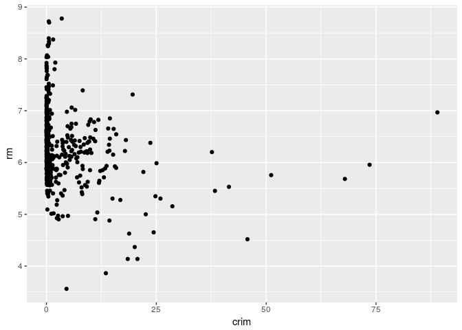
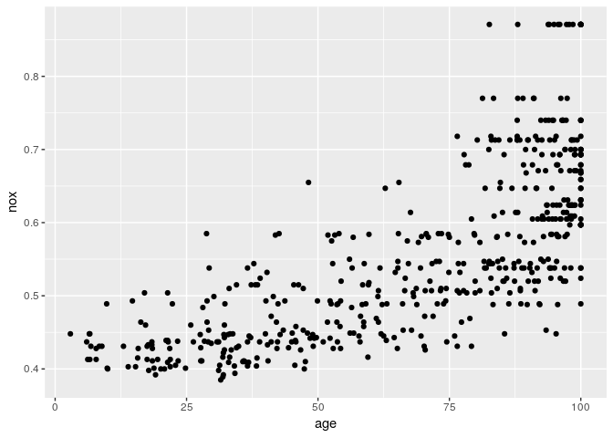
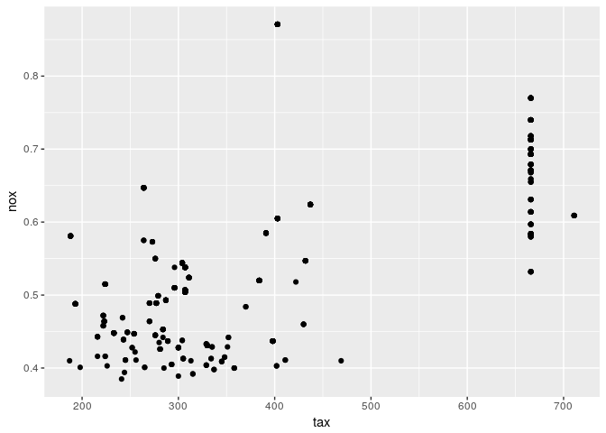
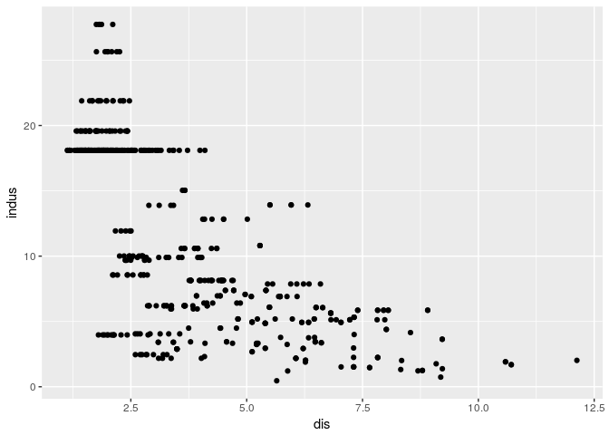
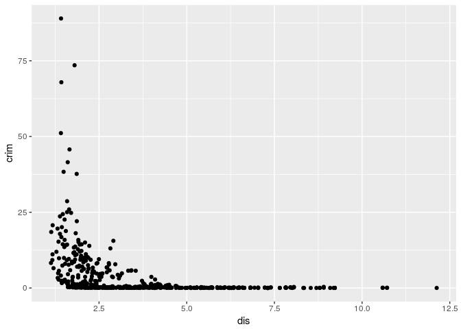
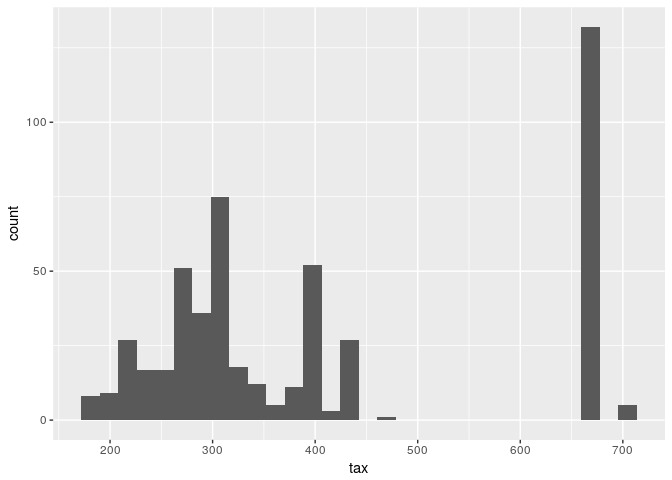
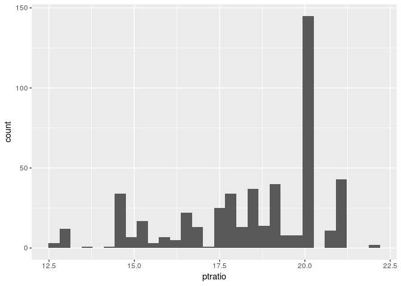

```r
suppressMessages(library(MASS))
suppressMessages(library(dplyr))
suppressMessages(library(ggplot2))
suppressMessages(library(pander))

bos = Boston
```


#1.
  
  a. Since the sample size is large there will be a smaller variance. We can use a flexible method here since we are starting with a low variance.
  
  b. Since the variance will be high for this sample, we should use a less flexible method so we dont significantly increase the variance. 
  
  c. Since the relationship is nonlinear we should use a more flexible method since linear regression is not very flexible. 
  
  d. Since the variance of the error terms is high we should use a less flexible method so we don't significantly increase the variance. 
  

#2.
  
  a. We would use regression and are interested in inference. P is the ceos' salary and N is the firms. 
  
  b. This is a classification problem and we are interested in prediction. P is success/failure and N is the sample products. 
  
  c. This is a regression problem and we are interested om prediction. P is % change in the USD/Euro market and n would be the stock market data. 
  
#4. 

  a. One example would be a state voting for one political party or the other. The response would be how they vote and the predictors could be demographics or a survey or responses. Our goal would be prediction. Another example could be predicting if opening a store will get customers. The response would be yes or no and the predictors could be the success of other stores in the area. Our goal would be prediction. A final example could be predicting if students will pass a class. The response will be yes or no and the predictors could be previous grades. 
  
  b. We could use regression to predict the height that plants grow based on how much nitrogen they reciece. The response would be height and the predictors would be nitrogen amount. This would be a prediction problem. Another example of regression would be predicting the age that someone starts smoking. The age would be the response and a bunch of demographics could be the predictors. One more use of regression would be predicting future salary. Salary would be the response and the predictors could be education, current salary, and seniority. 
  
  c. You could use cluster sampling when try to see how good students grades are. The clusters can be by freshman, sophomore, junior, senior, and graduate. The response would be grades and the predictors would be major and demographic variables. Another could be if a disease effects some trees. One cluster could trees near water and the other could be trees surrounded by land. The response would be if it is diseased and the predictors could be location, type of tree, and age. One more example could be predicting how much money people spend at a business. The clusters could be by groups of income. The response would be how much they spend and the predictors would be demographic variables and how much they go shopping.  
  
  
  
#10 b.


```r
ggplot(data=bos,aes(x=crim,y=nox)) + geom_point()
```

<!-- -->

```r
ggplot(data=bos,aes(x=crim,y=rm)) + geom_point()
```

<!-- -->

```r
ggplot(data=bos,aes(x=age,y=nox)) + geom_point()
```

<!-- -->

```r
ggplot(data=bos,aes(x=tax,y=nox)) + geom_point()
```

<!-- -->

```r
ggplot(data=bos,aes(x=dis,y=indus)) + geom_point()
```

<!-- -->

It looks like as the age of the home increase, the nitrogen oxide concentration increases. As tax increases, so does nitrogen oxide, it appears. As the distance from 5 Boston employment centers increases, the proportion of non-retail busnesses decreases. 

#c. 

```r
ggplot(data=bos,aes(x=dis,y=crim)) + geom_point()
```

<!-- -->

As distance from employment centers increases, crime looks like it decreases. 

#d. 


```r
ggplot(data=bos,aes(x=crim))+geom_histogram()
```

```
## `stat_bin()` using `bins = 30`. Pick better value with `binwidth`.
```

<!-- -->

```r
ggplot(data=bos,aes(x=tax))+geom_histogram()
```

```
## `stat_bin()` using `bins = 30`. Pick better value with `binwidth`.
```

<!-- -->

```r
ggplot(data=bos,aes(x=ptratio))+geom_histogram()
```

```
## `stat_bin()` using `bins = 30`. Pick better value with `binwidth`.
```

<!-- -->

It seems crime can go from 0 to close to 100, with numbers bigger than 20 being unusal. Tax can go from 150ish to 700, with 700 maybe not being unusual. The ptratio can go from 12.5 to close to 22.5, with 22.,5 being unusual.  

#e. 

```r
bosriver = bos %>% filter(chas==1)
```
35 neighborhoods border the river. 
#f. 

```r
median(bosriver$ptratio)
```

```
## [1] 17.6
```

The median ptratio is 17.6.  

#g. 

```r
bos3 = bos %>% filter(medv == min(medv))
bos3
```

```
##      crim zn indus chas   nox    rm age    dis rad tax ptratio  black
## 1 38.3518  0  18.1    0 0.693 5.453 100 1.4896  24 666    20.2 396.90
## 2 67.9208  0  18.1    0 0.693 5.683 100 1.4254  24 666    20.2 384.97
##   lstat medv
## 1 30.59    5
## 2 22.98    5
```


There are 2 suburbs that have a medv of 5. They both have a high ptratio, a high age at 100, high nox, and a close distance to employment centers. 

#h.

```r
bos7rms = bos %>% filter(rm>=7)
bos8rms = bos %>% filter(rm>=8)

pander(summary(bos8rms))
```


-------------------------------------------------------------------
      crim              zn             indus             chas      
----------------- --------------- ---------------- ----------------
 Min.  :0.02009    Min.  : 0.00    Min.  : 2.680    Min.  :0.0000  

 1st Qu.:0.33147   1st Qu.: 0.00   1st Qu.: 3.970   1st Qu.:0.0000 

 Median :0.52014   Median : 0.00   Median : 6.200   Median :0.0000 

  Mean :0.71879     Mean :13.62     Mean : 7.078     Mean :0.1538  

 3rd Qu.:0.57834   3rd Qu.:20.00   3rd Qu.: 6.200   3rd Qu.:0.0000 

 Max.  :3.47428    Max.  :95.00    Max.  :19.580    Max.  :1.0000  
-------------------------------------------------------------------

Table: Table continues below

 
----------------------------------------------------------------
      nox              rm              age             dis      
---------------- --------------- --------------- ---------------
 Min.  :0.4161    Min.  :8.034    Min.  : 8.40    Min.  :1.801  

 1st Qu.:0.5040   1st Qu.:8.247   1st Qu.:70.40   1st Qu.:2.288 

 Median :0.5070   Median :8.297   Median :78.30   Median :2.894 

  Mean :0.5392     Mean :8.349     Mean :71.54     Mean :3.430  

 3rd Qu.:0.6050   3rd Qu.:8.398   3rd Qu.:86.50   3rd Qu.:3.652 

 Max.  :0.7180    Max.  :8.780    Max.  :93.90    Max.  :8.907  
----------------------------------------------------------------

Table: Table continues below

 
-------------------------------------------------------------------------------
      rad              tax           ptratio          black          lstat     
---------------- --------------- --------------- --------------- --------------
 Min.  : 2.000    Min.  :224.0    Min.  :13.00    Min.  :354.6    Min.  :2.47  

 1st Qu.: 5.000   1st Qu.:264.0   1st Qu.:14.70   1st Qu.:384.5   1st Qu.:3.32 

 Median : 7.000   Median :307.0   Median :17.40   Median :386.9   Median :4.14 

  Mean : 7.462     Mean :325.1     Mean :16.36     Mean :385.2     Mean :4.31  

 3rd Qu.: 8.000   3rd Qu.:307.0   3rd Qu.:17.40   3rd Qu.:389.7   3rd Qu.:5.12 

 Max.  :24.000    Max.  :666.0    Max.  :20.20    Max.  :396.9    Max.  :7.44  
-------------------------------------------------------------------------------

Table: Table continues below

 
--------------
     medv     
--------------
 Min.  :21.9  

 1st Qu.:41.7 

 Median :48.3 

  Mean :44.2  

 3rd Qu.:50.0 

 Max.  :50.0  
--------------

64 suburbs average more than 7 rooms per dwelling and 13 have more than 8 rooms. For 8 rooms, Mean crime is .71, They are somewhat close to employment centers with a median of 6. Tax is centered around 300. Nox is around .5.


